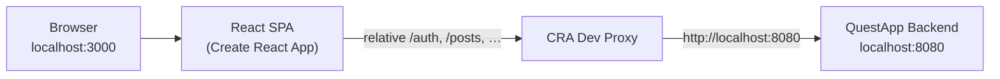
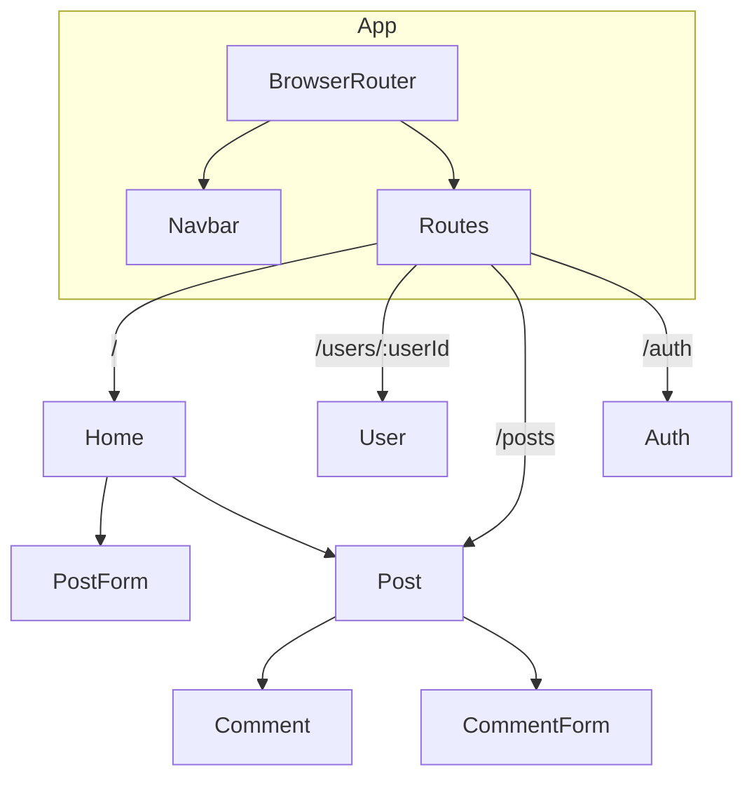
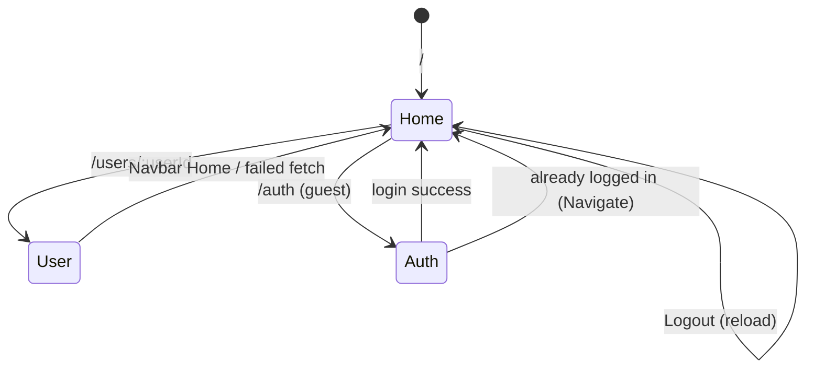
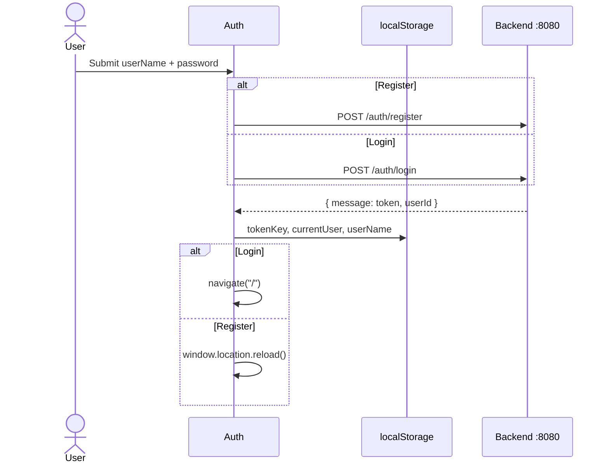
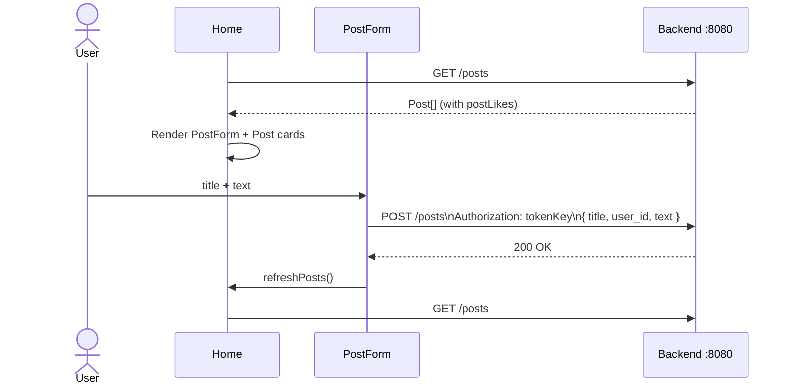
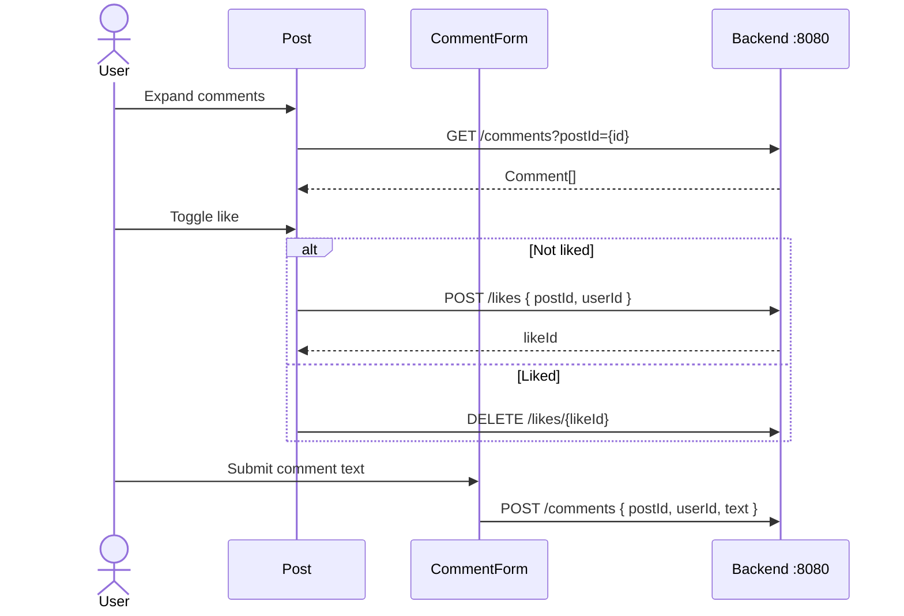
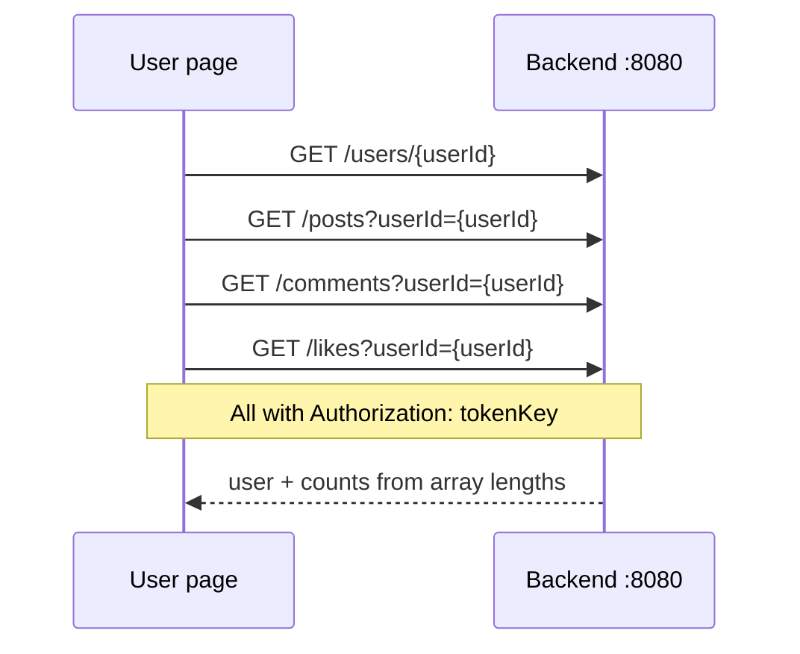
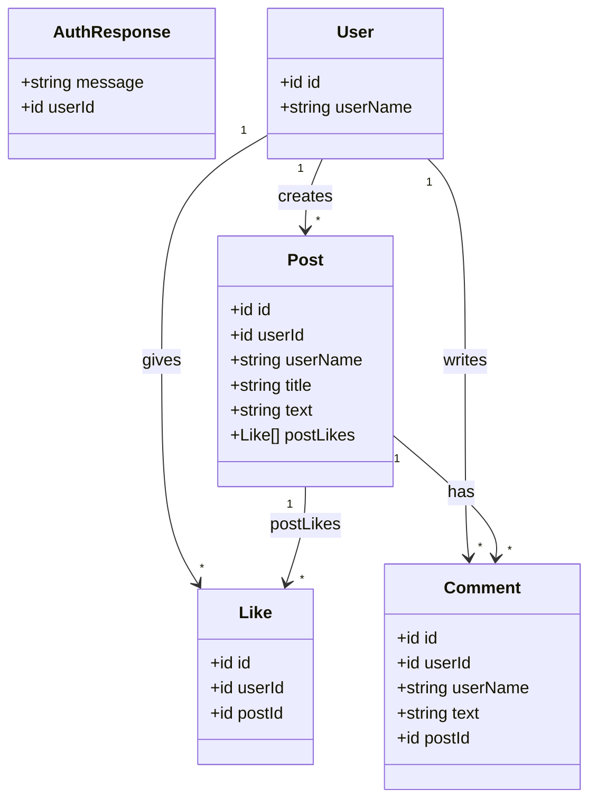
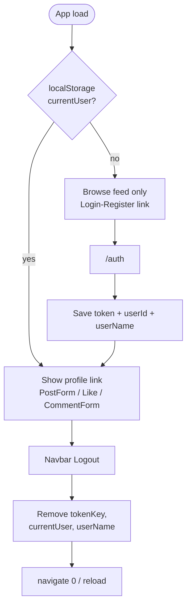
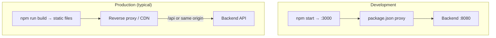

# QuestApp Frontend — Architecture & UML

This document describes the frontend architecture of **QuestApp** and provides Mermaid UML diagrams (component, sequence, class, and deployment views).

Related docs: [README.md](./README.md) · [README_TR.md](./README_TR.md) · [README_DE.md](./README_DE.md)

---

## 1. System overview



- UI: React 19 + MUI 7 + React Router 7
- Session: `localStorage` (`tokenKey`, `currentUser`, `userName`)
- HTTP: native `fetch` (no shared service layer; axios is unused)

---

## 2. Component diagram



### Hierarchy (text)

```
index.js
└── App
    └── BrowserRouter
        ├── Navbar
        └── Routes
            ├── /              → Home
            │                    ├── PostForm (if logged in)
            │                    └── Post[] → Comment[] + CommentForm
            ├── /users/:userId → User
            ├── /posts         → Post (standalone; typically used via Home with props)
            └── /auth          → Auth | Navigate → /
```

---

## 3. Routing & navigation



| Path | Guard / behavior |
|------|------------------|
| `/` | Public feed |
| `/users/:userId` | Needs token for API; failure → navigate `/` |
| `/auth` | If `currentUser` set → redirect `/` |
| `/posts` | Mounts `Post` without feed props |

---

## 4. Sequence diagrams

### 4.1 Register / login



### 4.2 Load feed & create post



### 4.3 Like & comments



### 4.4 User profile



---

## 5. Class / entity view (frontend DTOs)

Inferred from request/response usage (not TypeScript types):



### Create payloads

| Action | Body |
|--------|------|
| Auth | `{ userName, password }` |
| Create post | `{ title, user_id, text }` |
| Create comment | `{ postId, userId, text }` |
| Create like | `{ postId, userId }` |

---

## 6. Auth & session



**Header convention:** `Authorization: <tokenKey>` (raw token string).

---

## 7. Deployment / runtime view



> Production CRA builds do **not** include the `proxy` setting. Serve the SPA and API under the same origin, or introduce an explicit API base URL.

---

## 8. API map (frontend → backend)

| Method | Path | Component | Auth header |
|--------|------|-----------|-------------|
| `POST` | `/auth/register` | Auth | — |
| `POST` | `/auth/login` | Auth | — |
| `GET` | `/posts` | Home | — |
| `POST` | `/posts` | PostForm | ✓ |
| `GET` | `/posts?userId=` | User | ✓ |
| `GET` | `/comments?postId=` | Post | — |
| `GET` | `/comments?userId=` | User | ✓ |
| `POST` | `/comments` | CommentForm | ✓ |
| `POST` | `/likes` | Post | ✓ |
| `DELETE` | `/likes/{likeId}` | Post | ✓ |
| `GET` | `/likes?userId=` | User | ✓ |
| `GET` | `/users/{userId}` | User | ✓ |

---

## 9. Notes for maintainers

1. **No global state** — session is `localStorage` only; `App` reads `currentUser` once per mount.
2. **`Home` `useEffect` depends on `postList`** — can cause repeated refetch; prefer a dedicated refresh trigger.
3. **Post create uses `user_id`** — other payloads use camelCase `userId`.
4. **`/posts` route** mounts `Post` without required props; feed usage is the real path.
5. **CommentForm** does not refresh the parent comment list after submit until comments are re-expanded / re-fetched.
6. **`axios`** is listed in dependencies but unused; all calls use `fetch`.
